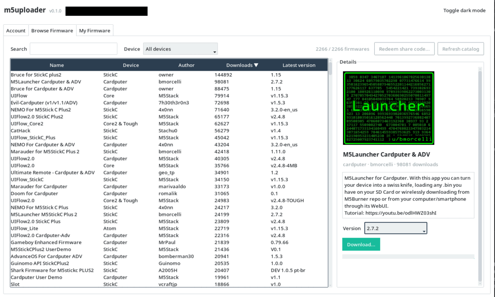

<h1 align="center">m5uploader</h1>

<p align="center">
  <b>A minimal, security-conscious replacement for M5Burner's account and firmware features</b>
</p>

<p align="center">
  <a href="#"></a>
  <a href="#"></a>
  <a href="LICENSE"></a>
  <a href="../../releases/latest"></a>
</p>

---

## Screenshot

<p align="center">
  
</p>

## Background

[M5Burner](https://docs.m5stack.com/en/quick_start/m5burner/intro) is M5Stack's official desktop app for browsing, downloading, and publishing device firmware. While using it, I found a number of security issues in the underlying Electron app - I've written up the full findings here: **[malloc.pw/2026/07/11/m5burner-is-a-mess](https://malloc.pw/2026/07/11/m5burner-is-a-mess/)**.

m5uploader is a from-scratch, from-first-principles reimplementation of the account and firmware-catalog side of M5Burner, built with a much smaller attack surface. It is **not** a fork or a patched version of the official app.

## Features

- **HTTPS-only.** Every request goes to the real M5Stack API over HTTPS with TLS verification on (the default `requests` behavior - never disabled). No plaintext HTTP, ever.
- **No embedded browser.** The GUI is native [ttkbootstrap](https://ttkbootstrap.readthedocs.io/) (themed `ttk`) - no Chromium, no Node, no remote page ever loaded into the app. Same look on Linux, Windows, and macOS, with a light/dark toggle.
- **Password isn't stored.** Only the session token is persisted - in your OS keychain when one is actually available and working, otherwise (transparently, with no broken login) in a plain `0600`-permissioned file. See [Session token storage](#session-token-storage) below for details.
- **Honest login state.** The saved token is checked on startup against an endpoint that actually requires auth, not just the public catalog. If it's no longer valid, you're asked to log in again instead of the UI pretending you're still logged in.
- **No automatic telemetry.** `ping_firmware_download()` exists for the same analytics endpoint the official app pings on every download, but the GUI never calls it.
- **No OS-specific shell-outs.** Same codebase, same behavior on Linux, Windows, and macOS.

### Account

Log in with your M5Stack account email/password; the session token is persisted so you don't need to log in every run. Registration is out of scope, same as the official app - register normally in your browser, then log in here.

### Browse Firmware

The full public firmware catalog, searchable and filterable by device, with cover art, descriptions, and per-version downloads. Redeem a share code someone sent you from a small dialog in the toolbar. The catalog (and its cover images) are cached locally so switching to this tab doesn't always re-fetch everything - "Refresh catalog" always bypasses the catalog cache, and the status line is honest about whether you're looking at a cached or freshly-fetched list. Each entry also has a **Flash...** button next to Download - it downloads straight into a local cache (skipping the download if it's already cached), then jumps you to the Flash Firmware tab with the file pre-loaded so you can pick a port and go. The ordinary Download button is unchanged and still always asks where to save.

### My Firmware

Everything published under your account: publish a new firmware or add a version to an existing one, edit metadata/files, toggle public/private visibility, delete a version, and create/rotate share codes.

### Flash Firmware

Flash a `.bin` straight to a connected M5Stack device: pick the serial port (likely M5Stack ports, detected by USB vendor/product ID, are pre-selected), pick the file (or arrive here pre-loaded via a catalog entry's Flash button), optionally erase the whole flash first, and go. A live log and a progress bar are shown throughout, with esptool's terminal escape codes and repeated progress lines filtered out so the log stays readable. Flashing is done entirely with [esptool](https://github.com/espressif/esptool), invoked as an isolated subprocess (never imported into this process - see [THIRD_PARTY_LICENSES.md](THIRD_PARTY_LICENSES.md) for why).

m5uploader never requests elevated privileges to do this. On Linux, if opening the port fails with a permission error, add yourself to the `dialout` group (`sudo usermod -aG dialout $USER`, then log out and back in) rather than running the app as root. On Windows and older macOS you may also need the board's USB-serial driver installed (Silicon Labs CP210x or WCH CH9102, depending on the board) - this is an OS/driver-level requirement outside the app's control.

### Planned

Currently out of scope by design: an in-app device manager (beyond the port picker above), and in-app account registration.

## Running from source

Requires Python 3.10+.

```sh
git clone https://github.com/cryptspeak/m5uploader.git
cd m5uploader
```

**Linux / macOS:**

```sh
python3 -m venv venv
source venv/bin/activate
pip install -r requirements.txt
python -m m5uploader
```

**Windows (PowerShell):**

```powershell
python -m venv venv
venv\Scripts\Activate.ps1
pip install -r requirements.txt
python -m m5uploader
```

**Windows (cmd.exe):**

```bat
python -m venv venv
venv\Scripts\activate.bat
pip install -r requirements.txt
python -m m5uploader
```

## Building a standalone executable

A standalone executable can be built with [PyInstaller](https://pyinstaller.org/). This now builds **two** executables: the main app (`run.py`) and a separate esptool helper (`esptool_helper.py`) used for flashing (see [THIRD_PARTY_LICENSES.md](THIRD_PARTY_LICENSES.md) for why flashing is a separate binary rather than an import).

**Linux / Windows** (single-file executables):

```sh
pip install pyinstaller
pyinstaller --onefile --windowed --name m5uploader run.py
pyinstaller --onefile --console --name m5uploader-esptool esptool_helper.py
```

Put both executables in the same directory before running - `m5uploader` looks for `m5uploader-esptool[.exe]` next to itself. CI packages them together (an AppImage on Linux, a zip on Windows) so a normal release download is still just one file/archive.

**macOS** (`.app` bundle - PyInstaller deprecates `--onefile` combined with `--windowed` on macOS):

```sh
pip install pyinstaller
pyinstaller --onedir --windowed --name m5uploader run.py
pyinstaller --onefile --console --name m5uploader-esptool esptool_helper.py
cp dist/m5uploader-esptool dist/m5uploader.app/Contents/MacOS/m5uploader-esptool
```

The result is written to `dist/`. CI builds this automatically on every push (see [Build](.github/workflows/build.yml)) and publishes it to the [Releases](../../releases) page whenever a `v*` tag is pushed.

## Session token storage

The session token (never the password - see Features above) is stored in your OS keychain (macOS Keychain, Windows Credential Locker, or Linux Secret Service via `keyring`) whenever one is actually present and working. On Linux, a keychain depends on a Secret Service backend (GNOME Keyring/KWallet) that isn't always present or unlocked, and a broken keychain can be hard to tell apart from "the token is invalid" - so on startup, m5uploader actually sets a value, reads it back, and deletes it to confirm the keychain works, rather than just checking that a backend object was constructed. If that check fails, it falls back to a plain `0600`-permissioned file instead, and login still works normally. An existing plain-file session is migrated into the keychain (and the plaintext copy removed) automatically the first time a working keychain is seen.

## Local caches

Everything below lives in your OS's proper *cache* directory - `~/.cache/m5uploader` on Linux (or `$XDG_CACHE_HOME`), `~/Library/Caches/m5uploader` on macOS, `%LOCALAPPDATA%\m5uploader` on Windows - deliberately separate from the config directory the session token lives in (see `config.py`), so a system "clear cache" tool can safely wipe all of this without touching your login. Every cache is written atomically and `0600`-permissioned; any missing, stale, or corrupted entry is simply treated as a cache miss and re-fetched, never trusted blindly.

- **Catalog** (`catalog_cache.json`) - the public firmware catalog, cached for 15 minutes so switching to Browse Firmware doesn't always re-fetch it. "My Firmware" (your own, authenticated firmware list) is never cached, since it changes whenever you edit it.
- **Cover images** (`covers/`) - keyed by a hash of the cover's server identifier, never the identifier itself (path-traversal defense-in-depth), capped at 150 MB total with oldest-first eviction.
- **Downloaded firmware** (`firmware/`) - only used by the catalog's Flash button shortcut (see Flash Firmware above), capped at 1.5 GB total with oldest-first eviction. The ordinary Download button doesn't use this cache at all - it always saves exactly where you tell it to.

## Project layout

```
m5uploader/
  m5uploader/
    api.py             M5Stack API client (login, catalog, share codes,
                        publish/edit/delete/visibility, cover compression)
    auth_store.py      Session token storage: OS keychain, falling back to
                        a plain 0600-permissioned file (token + username)
    catalog_cache.py   Local cache of the public firmware catalog
    config.py          Paths / hosts
    firmware_cache.py  Local cache of firmware downloaded via the catalog's
                        Flash button shortcut
    flashing.py        On-device flashing via an isolated esptool subprocess
    gui.py             ttkbootstrap GUI (Account / Browse Firmware /
                        My Firmware / Flash Firmware)
    image_cache.py     Local cache of firmware cover images
  esptool_helper.py     PyInstaller entry point for the bundled esptool helper
  run.py                PyInstaller entry point for the main app
  requirements.txt
```

## Security

Found a security issue in m5uploader itself? Please open an issue.

See [THIRD_PARTY_LICENSES.md](THIRD_PARTY_LICENSES.md) for the one deliberate exception to this project's otherwise-permissive dependency licensing (esptool, GPLv2+, used only as an isolated subprocess).

## License

[Apache License 2.0](LICENSE).
